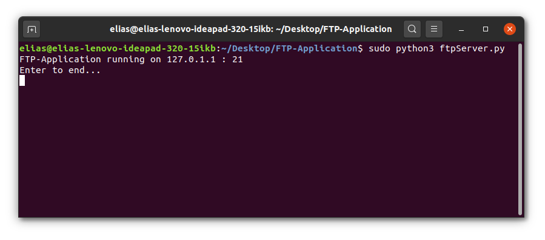
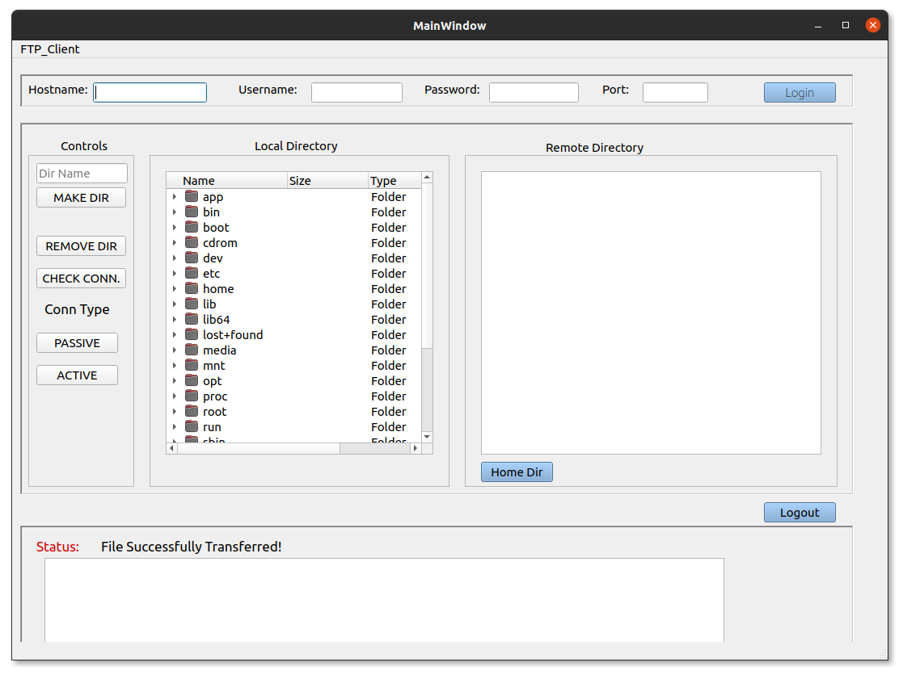
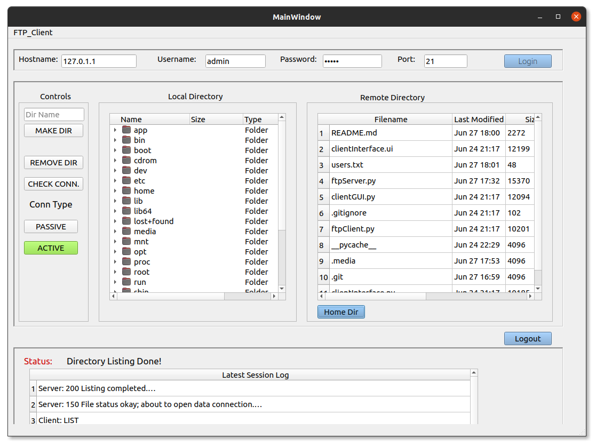

# FTP-Application
A basic ftp application using python3 sockets for server and client
### 1. Pre-requisites:
  * [PyQt5](https://pypi.org/project/PyQt5/) - Used for the graphical user interface.
  * [Python3](https://realpython.com/installing-python/) obviously!
### 2. Installation
* Simple clone the repo 
   ```sh 
   $ git clone https://github.com/Sephoro/FTP-Application.git
   ```
* After a succesful clone, run the command:
    ```sh 
    $ cd FTP-Application
    ```
    to go into the application directory
### 3. Execution 
##### 3.1 Server Execution
* Having gone through sections 1 and 2, on the very same command line, to start the server run the following command:
  ```sh
  $ sudo python3 ftpServer.py
  ```
  * Why **`sudo`**? Because the application uses the all important port 21, which is the official port for FTP.
  * If you are using **Windows** on the command line just simply type the above command without **`sudo`**. For Windows run the command:
  ```sh
    python ftpServer.py
  ```
* After running the above command you should see a similar output to the following:
  
  * The numerals **`127.0.1.1`** is the server IP (Yours might be different) and the numeral **`21`** is the port number as previously mentioned.
  
##### 3.2 Client execution

* Having installed [PyQt5](https://pypi.org/project/PyQt5/), to run the client open another command line/terminal in the same directory as the server (**PS Don't stop the server!**)
* Execute the following command:
  ```sh
  $ python3 clientGUI.py
  ```
  * Notice that we didn't use **`sudo`** here, why? Because we are not fidling with important ports when running the client.
  * Windows users, replace ``python3`` with ``python``.
* After execution of the previous command the following screen should appear:
  
* **To contact the server**
    * Enter the server IP on the hostname.
    * The username and passwords are stored in the [users.txt](users.txt) file. You have two options:
      * Use the already existing usernames and passwords
      * Adding your own in the following format
        * ```<username> <password>```
        * On terminal you can simply run the following command to add a new user:
            ```sh
            $ echo <username> <password> >> users.txt
            ``` 
  * The port is 21 as previously mentioned.
  * After entering the details the following should appear on the interface:
    
* **HAPPY TRANSFERRING!**

### 4. Troubleshooting
* The server and the client are **not** dependent on each other.
  #### 4.1 Client Side
* If the client gives you problems mainly due to Python3 and PyQT5, you can simply run the server and hit it using other FTP Clients like [FileZilla](https://filezilla-project.org/download.php).
  #### 4.2 Server Side
* The same goes for server problems, if the server gives you problems you can simply run the client on it's own and try hitting free FTP test sites such as [ftp://speedtest.tele2.net ](http://speedtest.tele2.net/):
    * The hostname is : ``speedtest.tele2.net``
    * The username is : ``anonymous``
    * The password is : ``anonymous``
    *  The port is 21
